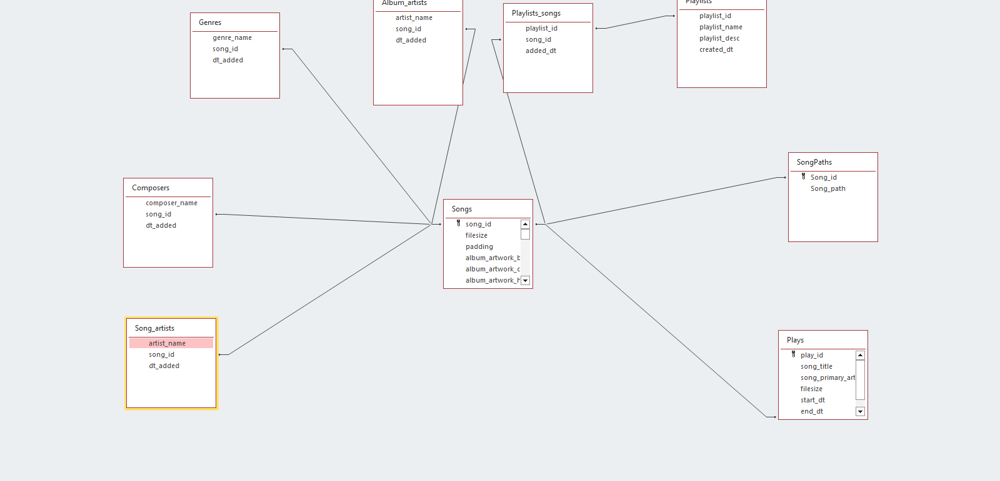

# decibl-metadata

Rust backend crate

https://doc.rust-lang.org/book/ch07-02-defining-modules-to-control-scope-and-privacy.html

https://www.tutorialspoint.com/rust/rust_modules.htm

https://web.mit.edu/rust-lang_v1.25/arch/amd64_ubuntu1404/share/doc/rust/html/book/first-edition/crates-and-modules.html

